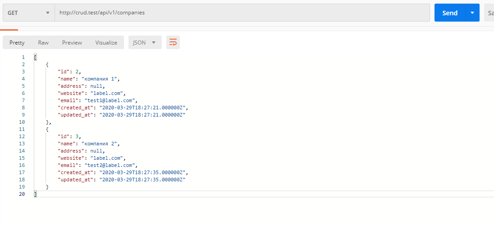

В нашем примере мы создадим CRUD (Create / Read / Update / Delete) приложение, для управления списком компаний.


**Необходимые зависимости**
1. PHP >= 7.2, (команда для проверки версии php -v )
2. composer пакетный менеджер для php библиотек
3. Node js >= 10.0, (команда для проверки версии node -v)
4. npm (устаналивается вместе с Node js) пакетный менеджер для js библиотек
5. субд Mysql/PostgreSQl

**Часть 1.1 Установка фрейморка laravel**

Установим последнюю версию через composer:
```shell script
composer require laravel/laravel
```

_**Все команды будут выполняться из директории созданного проекта!**_

После процесса установки проверим версию laravel:
```shell script
php artisan -V

Laravel Framework 7.3.0
```

**Часть 1.2 первоначальная настройка.**

При установки laravel через composer, автоматически создался файл .env в корне проекта, если это не так, то, необходимо
создать его вручную скопировав из примера .env.example

Что необходимо проверить в .env

- Параметр APP_KEY, он должен равнятся случайно сгенерированной строке, это защитный ключ приложения.
    - Если параметр пуст то выполнить
    ```shell script
    php artisan key:generate
    ```
- Настройки подключение базы данных:
    - Создайте пустую базу данных любым удобным вам способом (HeidiSQL, phpmyadmin, workbench, cli)
    - Укажите параметры подключения к ней:
    ```apacheconfig
    DB_CONNECTION=mysql # драйвер
    DB_HOST=127.0.0.1 # адрес
    DB_PORT=3306 # порт
    DB_DATABASE=laravel # имя БД
    DB_USERNAME=root # login
    DB_PASSWORD= # pass
    ```
  
Остальные настройки можно оставить по умолчанию.

Для проверки работоспособности базы данных выполните:

```shell script
php artisan migrate

# Вывод результата:
Migration table created successfully.
Migrating: 2014_10_12_000000_create_users_table
Migrated:  2014_10_12_000000_create_users_table (0.49 seconds)
Migrating: 2019_08_19_000000_create_failed_jobs_table
Migrated:  2019_08_19_000000_create_failed_jobs_table (0.22 seconds)

```

Это действие создаст необходимые таблицы для работы, все миграции расположены в директории:
```shell script
/database/migrations
```

Для дальнейшей работы нам понадобится таблица companies и модель данных.
Создать и модель и миграцию:

```shell script
php artisan make:model Company -m

# Model created successfully.
# Created Migration: 2020_03_29_110517_create_companies_table

```


Данная команда создала файл App/Company.php

<details>
    <summary>Код Company.php</summary>
    
```php

<?php

namespace App;

use Illuminate\Database\Eloquent\Model;

class Company extends Model
{
    //
}
```
   
</details>  


и файл миграции database/{datetime}_create_companies_table.php

<details>
    <summary>create_companies_table.php</summary>
    
```php

<?php

use Illuminate\Database\Migrations\Migration;
use Illuminate\Database\Schema\Blueprint;
use Illuminate\Support\Facades\Schema;

class CreateCompaniesTable extends Migration
{
    /**
     * Run the migrations.
     *
     * @return void
     */
    public function up()
    {
        Schema::create('companies', function (Blueprint $table) {
            $table->id();
            $table->timestamps();
        });
    }

    /**
     * Reverse the migrations.
     *
     * @return void
     */
    public function down()
    {
        Schema::dropIfExists('companies');
    }
}

```
   
</details>


Изменим метод up в миграции:

```php

public function up()
{
    Schema::create('companies', function (Blueprint $table) {
        // создаст поле id с типом int, автоинкрементное
        $table->id();
    
        // создаст простые текстовые поля
        $table->string('name')->nullable();
        $table->string('address')->nullable();
        $table->string('website')->nullable();
        $table->string('email')->nullable();
    
        // создаст 2 поля created_at, updated_at типа timestamp
        $table->timestamps();
    });
}

```

И выполним команду миграции:
```shell script
php artisn migrate
```

Обьявим переменную в классе Company, которая отвечает за доступность записи определенные полей в базе данных

```php
protected $fillable = ['name', 'address', 'website', 'email'];

```

Общий вид файлов:

<details>
    <summary>create_companies_table.php</summary>
    
```php

<?php

use Illuminate\Database\Migrations\Migration;
use Illuminate\Database\Schema\Blueprint;
use Illuminate\Support\Facades\Schema;

class CreateCompaniesTable extends Migration
{
    /**
     * Run the migrations.
     *
     * @return void
     */
    public function up()
    {
        Schema::create('companies', function (Blueprint $table) {
            $table->id();
            $table->string('name')->nullable();
            $table->string('address')->nullable();
            $table->string('website')->nullable();
            $table->string('email')->nullable();
            $table->timestamps();
        });
    }

    /**
     * Reverse the migrations.
     *
     * @return void
     */
    public function down()
    {
        Schema::dropIfExists('companies');
    }
}


```
   
</details>

<details>
    <summary>Company.php</summary>
    
```php

<?php

namespace App;

use Illuminate\Database\Eloquent\Model;

class Company extends Model
{
    protected $fillable = ['name', 'address', 'website', 'email'];
}


```
   
</details>

**Часть 2.1. Создание front контроллера и маршрута**

Laravel использует маршруты для определения того какое действие необходимо выполнить с текущем http запросом и контроллеры для
выполнения конкретных действий.

Для автоматической генерации файла контроллера выполнить:

```shell script
php artisan make:controller Api/V1/CompaniesController --api
```

Команда создаст заготовку контроллера APP/Http/Controllers/Api/V1/CompaniesController.php

<details>
    <summary>пример CompaniesController.php</summary>
    
```php

<?php

namespace App\Http\Controllers\Api\V1;

use App\Http\Controllers\Controller;
use Illuminate\Http\Request;

class CompaniesController extends Controller
{
    /**
     * Display a listing of the resource.
     *
     * @return \Illuminate\Http\Response
     */
    public function index()
    {
        //
    }

    /**
     * Store a newly created resource in storage.
     *
     * @param  \Illuminate\Http\Request  $request
     * @return \Illuminate\Http\Response
     */
    public function store(Request $request)
    {
        //
    }

    /**
     * Display the specified resource.
     *
     * @param  int  $id
     * @return \Illuminate\Http\Response
     */
    public function show($id)
    {
        //
    }

    /**
     * Update the specified resource in storage.
     *
     * @param  \Illuminate\Http\Request  $request
     * @param  int  $id
     * @return \Illuminate\Http\Response
     */
    public function update(Request $request, $id)
    {
        //
    }

    /**
     * Remove the specified resource from storage.
     *
     * @param  int  $id
     * @return \Illuminate\Http\Response
     */
    public function destroy($id)
    {
        //
    }
}


```
   
</details>

Днный класс содержит методы которые будут отвечать на соотвествующие http запросы

 - index - GET:  /api/v1/companies
 - show - GET: /api/v1/companies/{id}
 - store - POST: /api/v1/companies
 - update - PUT: /api/v1/companies/{id}
 - destroy - DELETE: /api/v1/companies/{id}
 
Данные пути нужно прописать в файле routes/api.php:

```php
<?php

use Illuminate\Http\Request;
use Illuminate\Support\Facades\Route;

Route::get('/v1/companies', 'Api\v1\CompaniesController@index');
Route::get('/v1/companies/{id}', 'Api\v1\CompaniesController@show');
Route::post('/v1/companies', 'Api\v1\CompaniesController@store');
Route::put('/v1/companies/{id}', 'Api\v1\CompaniesController@update');
Route::delete('/v1/companies/{id}', 'Api\v1\CompaniesController@destroy');

```

Просмотрим пути выполнив команду
```shell script
php artisan route:list
```
Список доступных путей
```shell script
+--------+----------+----------------------------+------+--------------------------------------------------------+------------+
| Domain | Method   | URI                        | Name | Action                                                 | Middleware |
+--------+----------+----------------------------+------+--------------------------------------------------------+------------+
|        | GET|HEAD | /                          |      | Closure                                                | web        |
|        | GET|HEAD | api/v1/companies           |      | App\Http\Controllers\Api\v1\CompaniesController@index  | api        |
|        | POST     | api/v1/companies           |      | App\Http\Controllers\Api\v1\CompaniesController@store  | api        |
|        | GET|HEAD | api/v1/companies/{id}      |      | App\Http\Controllers\Api\v1\CompaniesController@show   | api        |
|        | PUT      | api/v1/companies/{id}      |      | App\Http\Controllers\Api\v1\CompaniesController@update | api        |
|        | DELETE   | api/v1/companies/{id}      |      | App\Http\Controllers\Api\v1\CompaniesController@destroy | api        |
+--------+----------+----------------------------+------+--------------------------------------------------------+------------+

```

Обратит внимание на то что все пути идут с префиксом /api/ хотя мы это и не писали, laravel автоматически добавляет
префикс для всех путей в файле api.php

Если мы хотим сделать наше api версионным, то указывать версию нашего api удобно прямо в путях. например:
 - api/v1/companies  
 - api/v2/companies
 - ...
 
Это позволяет нам обновлять наше приложение не поломав работу тех клиентов что уже пользуются более старой версией нашего api.

В конце статьи будет пример как можно улучшить текущую схему описания путей, но пока что нам хватит и этого.


**Часть 2.2. Создание логики обработки действий в контроллере.**

***В этом разделе пропишем все необходимые дейтсвия create, read, update, delete с нашей моделью Company.***

Перед всеми действиями выполнить импорт модели Company в классе CompaniesController:

```php
use App\Company;
```

##### **Методы index и show.**

метод index :

```php

public function index()
{
    $companiesList = Company::all();

    return response()->json($companiesList, 200);
}

```

Данный код
```php
return response()->json($companiesList, 200);
```
возвращает ответ, который содержит массив (коллекцию) обьектов класса Company, каждый из которых представляет собой строку
из таблицы companies в базе данных, либо пустой массив если записей не обнаружено. Ответ возвращается в формате json,
дополнительно устанавливается код ответа 200, что свидетельствует об успешности запроса.

Пример ответа при пустом результате:


Пример ответа при найденых записях:



метод show :

```php

public function show($id)
{
    $company = Company::find($id);
    return response()->json($company, 200);
}

```

Данный код
```php
return response()->json($company, 200);
```
возвращает ответ, который содержит список полей обьекта класса Company, который представляет собой строку
из таблицы companies в базе данных, либо пустой обьект {}, если записи не обнаружено. Ответ возвращается в формате json,
дополнительно устанавливается код ответа 200, что свидетельствует об успешности запроса.

Пример ответа при пустом результате:


Пример ответа при пустом результате:


метод store :

```php

public function store(Request $request)
{
    $newCompany = Company::create($request->all());

    return response()->json($newCompany, 200);
}

```

Данный код
```php
return response()->json($newCompany, 200);
```
возвращает ответ, который содержит список полей нового обьекта класса Company, который представляет собой новую строку
из таблицы companies в базе данных. Ответ возвращается в формате json,
дополнительно устанавливается код ответа 200, что свидетельствует об успешности запроса.

Пример ответа:


метод update :

```php

public function update(Request $request, $id)
{
    $company = Company::find($id);

    if (!$company) {
        return response()->json(null, 404);
    }

    $company->update($request->all());

    return response()->json($company, 200);
}

```

Пример ответа:


метод destroy :

```php

public function destroy($id)
{
    $company = Company::find($id);

    $company->delete();

    return response()->json([], 200);
}

```

Пример ответа:


**Часть 3.1. Установка и подготовка vue js, bootstrap**

В последних версий laravel фреймворк vue js, как и bootstrap вынесен в отдельный пакет, и по умолчанию не установлен.
Для установки данных пакетов выполнить.

```shell script
composer require laravel/ui
```

Далее выполнив команду

```shell script
php artisan ui vue
```

vue автоматически пропишется как зависимоть проекта в файл package.json

осталось выполнить комнаду
```shell script
npm install
```
для установки всех библиотке в папку node_modules

Следующим шагом удалить содержимое файлов в папке resources/js/:
    - app.js
    - bootstrap.js
    - удалить файл components/ExampleComponent.vue
    - очистить файл resources/views/layouts/app.blade.php
    
**Часть 3.2. Редактирование шаблона**

Данное приложение является SPA (single page application), это означает что все http запросы должны обрабатываться
на одной странице.

За отображение данной страницы будет выступать шаблон /resources/layouts/app.blade.php

```blade
<!doctype html>
<html lang="en">
<head>
    <title>SPA</title>
</head>
<body>
    <div id="app"></div>
    <script src="{{mix('js/app.js')}}"></script>
</body>
</html>

```


Далее файл /routes/web.php приведем к следующему виду:

```php
<?php

use Illuminate\Support\Facades\Route;

Route::get('/{any}', function () {
    return view('layouts.app');
})->where('any', '.*');

```
Тем самым мы отображаем все запросы внтури шаблона /resources/layouts/app.blade.php